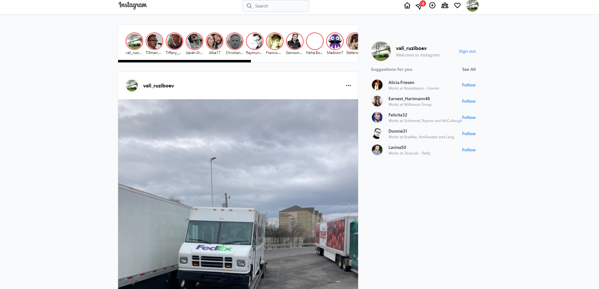

## Instagram Clone

Fully responsive Instagram clone.

## Table of contents
- [Overview](#overview)
  - [The features](#the-features)
  - [Screenshot](#screenshot)
  - - [Links](#links)
- [Built with](#built-with)
- [Author](#author)

## Overview

### The features

Users are be able to:

- View the optimal layout for the app depending on their device's screen size
- See hover states for all interactive elements on the page
- Log in and Log out with GOOGLE
- Real Time post picture with caption
- Like and ulike a post
- Comment a post

### Screenshot

### Links

- Live Site URL: [Live site URL here](https://vali-ruziboev-insta-clone.vercel.app/)

### Built with

- Semantic HTML5 markup
- Flexbox
- Grid
- Mobile-first workflow
- Next.js
- NextAuth
- Recoil
- Tailwind CSS
- Firebase

## Author

- Twitter - [Vali Ruziboev](https://twitter.com/Vali_Ruziboev)
- Instagram - [valiruziboev](https://www.instagram.com/vali_ruziboev/)
- Linkedin - [Vali Ruziboev](https://www.linkedin.com/in/vali-ruziboev/)
